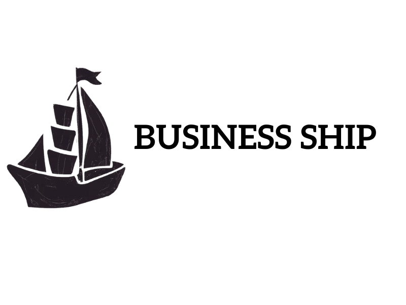

<!-- PROJECT SHIELDS -->
<!--
*** I'm using markdown "reference style" links for readability.
*** Reference links are enclosed in brackets [ ] instead of parentheses ( ).
*** See the bottom of this document for the declaration of the reference variables
*** for contributors-url, forks-url, etc. This is an optional, concise syntax you may use.
*** https://www.markdownguide.org/basic-syntax/#reference-style-links
-->
[![Contributors][contributors-shield]][contributors-url]
[![Forks][forks-shield]][forks-url]
[![Stargazers][stars-shield]][stars-url]
[![Issues][issues-shield]][issues-url]
[![MIT License][license-shield]][license-url]
[![LinkedIn][linkedin-shield]][linkedin-url]

<!-- PROJECT LOGO -->
 

  

<h3 align="center">Business Ship</h3>

  

    help small businesses stay afloat!
     
    <a href="https://github.com/arncv/Business-Ship"><strong>Explore the docs »</strong></a>
     
     
    <a href="https://github.com/arncv/Business-Ship">View Demo</a>
    ·
    <a href="https://github.com/arncv/Business-Ship/issues">Report Bug</a>
    ·
    <a href="https://github.com/arncv/Business-Ship/issues">Request Feature</a>
  

## Built With

 
 

[![Product Name Screen Shot][product-screenshot]](http://businessship.co/)

## Inspiration
 After the COVID-19 pandemic, many small businesses wiped away. Right now, due to high inflation, big business are crushing local businesses, and they are forced to shut down. In order to give back to the community and support local economies, we created Business Ship.
 
 

## What it does
Business Ship brings microentrepreneurs, and they help the small-businesses to generate revenue by selling their products to consumers. Through this, customers could also directly contact the businesses and negotiate directly. This would help in creating a healthy & thriving local economy.

## How we built it
 The website was built with HTML5, CSS3 & JavaScript. Along with these, we used Twilio Sandbox for WhatsApp for interacting with people. The website was deployed using Github-pages & a custom domain was used.

(<a href="#readme-top">back to top</a>)

## Challenges we ran into
 The biggest challenge faced by us was the integration of WhatsApp in Twilio Sandbox.
 
 

## Accomplishments that we're proud of
 The User-Interface of the website is really minimal and intuitive. 
 
 

## What we learned
 Learned Twilio and how to deploy WhatsApp for Twilio Sandbox.
 DALL-E was fun, the logo was generated by an AI :) 

## What's next for Business Ship
 Introducing a chatbot directly connected with e-mail.
 Show location-wise data of small businesses so that people could support them.

See the [open issues](https://github.com/arncv/Business-Ship/issues) for a full list of proposed features (and known issues).

(<a href="#readme-top">back to top</a>)

<!-- CONTRIBUTING -->
## Contributing

Contributions are what make the open source community such an amazing place to learn, inspire, and create. Any contributions you make are **greatly appreciated**.

If you have a suggestion that would make this better, please fork the repo and create a pull request. You can also simply open an issue with the tag "enhancement".
Don't forget to give the project a star! Thanks again!

1. Fork the Project
2. Create your Feature Branch (`git checkout -b feature/AmazingFeature`)
3. Commit your Changes (`git commit -m 'Add some AmazingFeature'`)
4. Push to the Branch (`git push origin feature/AmazingFeature`)
5. Open a Pull Request

(<a href="#readme-top">back to top</a>)

<!-- LICENSE -->
## License

Distributed under the MIT License. See `LICENSE` for more information.

(<a href="#readme-top">back to top</a>)

<!-- CONTACT -->
## Contact

Arnav Goel  - [@arnvgl](https://twitter.com/arnvgl) - arnvgl@pm.me

Project Link: [https://github.com/arncv/Business-Ship](https://github.com/arncv/Business-Ship)

(<a href="#readme-top">back to top</a>)

(<a href="#readme-top">back to top</a>)

<!-- MARKDOWN LINKS & IMAGES -->
<!-- https://www.markdownguide.org/basic-syntax/#reference-style-links -->
[contributors-shield]: https://img.shields.io/github/contributors/arncv/Business-Ship.svg?style=for-the-badge
[contributors-url]: https://github.com/arncv/Business-Ship/graphs/contributors
[forks-shield]: https://img.shields.io/github/forks/arncv/Business-Ship.svg?style=for-the-badge
[forks-url]: https://github.com/arncv/Business-Ship/network/members
[stars-shield]: https://img.shields.io/github/stars/arncv/Business-Ship.svg?style=for-the-badge
[stars-url]:https://github.com/arncv/Business-Ship/stargazers
[issues-shield]: https://img.shields.io/github/issues/arncv/Business-Ship.svg?style=for-the-badge
[issues-url]: https://github.com/arncv/Business-Ship/issues
[license-shield]: https://img.shields.io/github/license/arncv/Business-Ship.svg?style=for-the-badge
[license-url]: https://github.com/arncv/Business-Ship/blob/master/LICENSE
[linkedin-shield]: https://img.shields.io/badge/-LinkedIn-black.svg?style=for-the-badge&logo=linkedin&colorB=555
[linkedin-url]: https://linkedin.com/in/arnvgl
[product-screenshot]: assets/img/brand/screenshot.png
